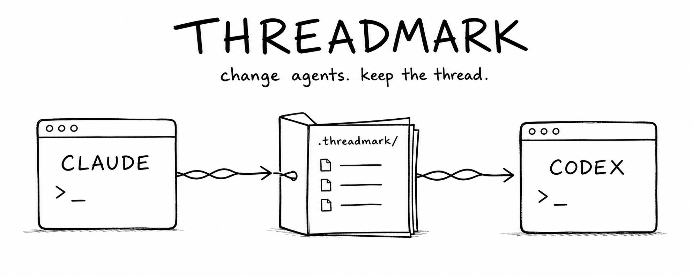

# Threadmark

<p align="center">
  
</p>

<p align="center">
  <strong>Shared project context for Claude Code and Codex.</strong><br>
  Switch agents without re-explaining the repository.
</p>

<p align="center">
  Local-first | Markdown-native | Zero dependencies | No daemon
</p>

Claude knows the project. Codex starts cold. Threadmark keeps both on the same page with small, reviewable context stored beside the code.

## Why Threadmark

- Switch between Claude Code and Codex without repeating project context.
- Load only relevant knowledge instead of a giant instruction file.
- Preserve decisions, verified lessons, and current branch state.
- Keep existing `.claude/` and `.codex/` configuration untouched.

## Quick start

Requires Node.js 20 or newer. From your Threadmark clone:

```bash
npm link
```

Then run inside an existing project:

```bash
threadmark scan
threadmark init --dry-run
threadmark init
threadmark doctor
```

Edit `.threadmark/kernel.md`, activate the context documents you trust, and continue using Claude Code or Codex normally. Their native project instructions load the Threadmark bootstrap automatically.

## How it works

```text
AGENTS.md  --\
             +--> kernel --> index --> relevant context
CLAUDE.md  --/                    \--> branch handoff
```

The kernel stays below 350 tokens. Task packets default to 1,200 tokens and at most three deeper documents. Routing uses paths, tags, task terms, status, and freshness.

## Safe by design

Threadmark owns `.threadmark/` and only the text inside its managed markers in root `AGENTS.md` and `CLAUDE.md`.

- `scan` and `doctor` are read-only.
- `init --dry-run` previews every change.
- Re-running `init` preserves existing project memory.
- `uninstall` removes adapters but keeps `.threadmark/`.
- No hooks, MCP changes, transcript capture, network calls, or global configuration.

## Continue work

```bash
threadmark handoff create --objective "Add refresh-token rotation"
threadmark context "change authentication" --path src/auth/middleware.ts
```

Handoffs preserve verified branch state. Context packets select only documents relevant to the current task. See the [CLI reference](docs/CLI.md) for every command.

## Documentation

[Quick start](docs/QUICKSTART.md) | [Existing projects](docs/EXISTING_PROJECTS.md) | [Architecture](docs/ARCHITECTURE.md) | [Context model](docs/CONTEXT_MODEL.md) | [CLI](docs/CLI.md) | [Safety](docs/SAFETY.md) | [Alternatives](docs/ALTERNATIVES.md)

## Deliberately small

Threadmark does not capture transcripts, run a background service, use a vector database, or silently learn from every message. V1 favors context that is compact, inspectable, and hard to corrupt.

Early implementation. Review initialization changes before using Threadmark in an important repository.

MIT licensed.
